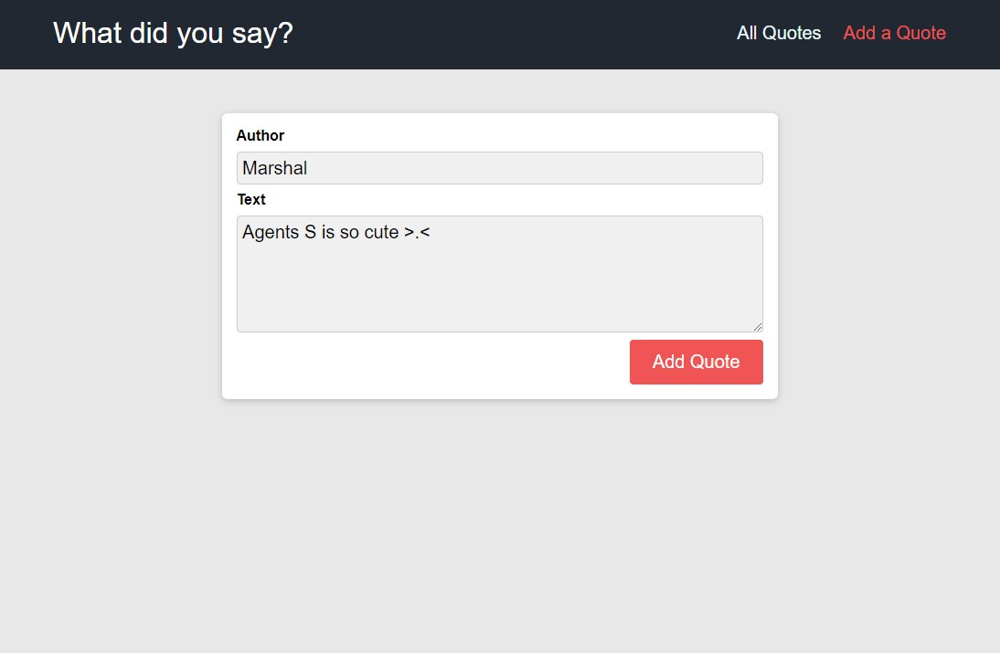

# What did you say Application

## Description

This web application let user add a quote and persist it to a database.  In addition, application will display all quotes fetch from the database.

## About the project

This project was coded while following along Academind's React the Complete Guide course.

## What have I learnt from this project
- Build a Single Page Application
- Use React Router Dom for routing URL to specific pages within the application
- How it use React Hooks such as useEffect, useCallback and useHttp
- How to communicate to Firebase realtime database from a React app
- Use CSS module to style components
